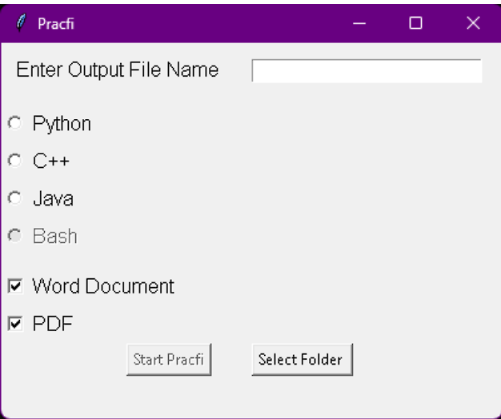

## Pracfi

Pracfi is a user-friendly application designed to streamline the process of creating interactive documents containing code snippets and graphical illustrations. With Pracfi, users can:

- Enter code directly into the application.
- Execute the code and capture screenshots of the results.
- Easily insert the screenshots into Microsoft Word documents (.docx files).

### Key Features:

- **Code Execution:** Run code within the application to visualize its output.
- **Screenshot Capture:** Capture screenshots of code execution results.
- **Integration with Microsoft Word:** Seamlessly insert screenshots into Word documents for documentation purposes.
- **Streamlined Documentation Workflow:** Ideal for producing documentation or lessons containing code and graphical illustrations.
- **Use Cases:** Suitable for students, educators, and software developers seeking to create interactive documents or automate documentation processes for software projects.


### Run the following commands to start using Pracfi
Installs all the dependencies
```console
python setup.py
```

Start the application

```console
python Pracfi.py
```
##### For Linux Systems use python3 instead of python in the above commands

